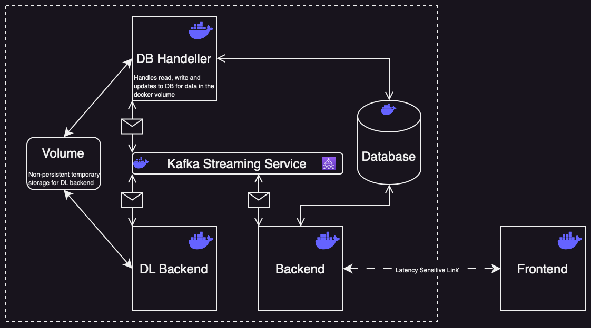

# TODX: Train your Own Detector toolboX

## Introduction 

TODX is a no-code image classification and object detection framework. It is built on **PyTorch Lightning** a lightweight wrapper for PyTorch.

## System Architecture 

## Model Zoo 

Out of the box the framework supports the following models.

#### Classification models
| Model   | Status      |
|---------|-------------|
|  LeNet  | in progress, not yet supported |

#### Object Detection models
| Model   | Status      |
|---------|-------------|
| YOLO-v1 | in progress, not yet supported |

## Dataset Zoo 

Out of the box the framework supports the following datasets.

#### Classification Datasets
| Dataset | Status      |
|---------|-------------|
|  MNIST  | in progress, not yet supported |

#### Object Detection Datasets
| Dataset | Status      |
|---------|-------------|
| PASCAL-VOC | in progress, not yet supported |

## License
The use of TODX is limited to academic purposes only, and any commercial use is explicitly forbidden.
